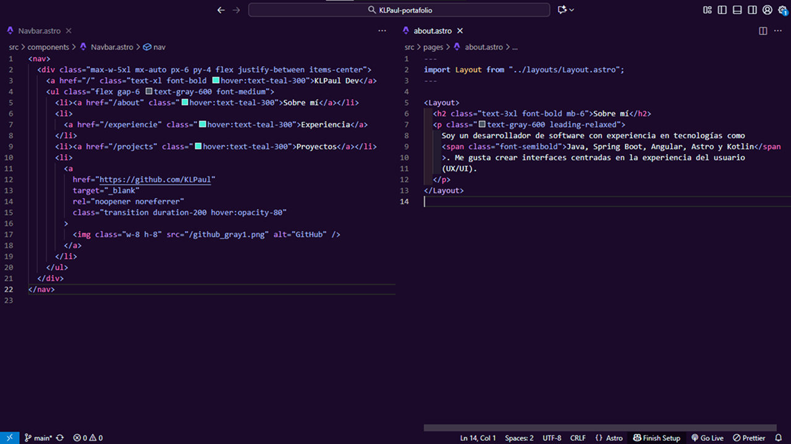

# 🌌 Ledian Theme

> _“Code under the light of the purple moon.”_

**Ledian** is a **dark purple theme** designed for developers who love elegance, depth, and visual harmony.  
Built to reduce eye strain and highlight code structure with a refined and modern color palette.

---

## 🖼️ Preview

---

## 💜 Features

- 🌑 **Deep dark purple background** (`#1B0A2A`) for focus and comfort  
- 🌸 **Lavender & lilac syntax tones** that bring clarity to keywords and tags  
- 🔮 **Cyan and violet highlights** for active elements and selections  
- 🖋️ Carefully tuned **contrast balance** for better readability  
- 💾 Compatible with:  
  - HTML / CSS / JS / TS  
  - React / Vue / Svelte  
  - Markdown / JSON / YAML  
  - Kotlin / Python / Java / PHP

---

## ⚙️ Installation

1. Open **Visual Studio Code**
2. Press `Ctrl + P` (or `Cmd + P` on macOS)
3. Paste the following command:

