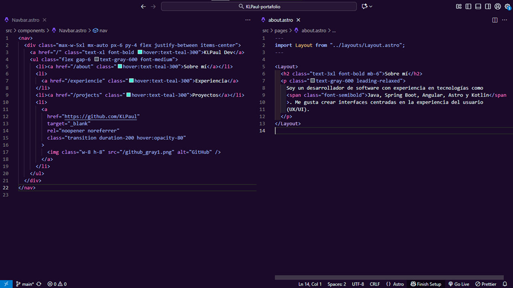

<p align="center">
  
</p>

<h1 align="center">Ledian Theme for VS Code</h1>

<p align="center">
  A deep, elegant theme inspired by the cosmic glow — blending <b>amber</b> and <b>cyan</b> tones for focus, calm, and creativity.
</p>

<p align="center">
  <a href="https://marketplace.visualstudio.com/items?itemName=KLPaul.ledian">
    
  </a>
  <a href="https://marketplace.visualstudio.com/items?itemName=KLPaul.ledian">
    
  </a>
  <a href="https://marketplace.visualstudio.com/items?itemName=KLPaul.ledian">
    
  </a>
</p>

---

<p align="center">
  
</p>

---

## Installation via VS Code

1. Open **Extensions** sidebar in VS Code → `View → Extensions`
2. Search for `Ledian Theme`
3. Click **Install**
4. Go to `Preferences → Color Theme → Ledian`
5. Enjoy your new dark cosmic look ✨

---

## Color Reference

### Syntax Colors

| Color | Usage |
|:------:|-------|
|  `#C792EA` | Keywords, decorators, interfaces |
|  `#82AAFF` | Functions, methods, constructors |
|  `#F78C6C` | Constants, numeric values |
|  `#C3E88D` | Strings, markdown headings |
|  `#FFCB6B` | Variables, object keys |
|  `#89DDFF` | Regular expressions, escape chars |
|  `#EEFFFF` | Default text |

---

### UI Colors

| Color | Usage |
|:------:|-------|
|  `#1B0A2A` | Workbench & sidebar background |
|  `#221034` | Editor background |
|  `#2E1B4B` | Editor groups, panels, dropdowns |
|  `#B39DDB` | Borders, inactive items |
|  `#E1BEE7` | Active text, highlights |
|  `#36A2EB` | Accent & selection highlights |
|  `#FFCB6B` | Warnings, badges, accent tones |
|  `#F07178` | Errors, deletions |
|  `#C3E88D` | Additions, success highlights |

---

## Recommended Setup

For the best visual experience:

```json
{
  "editor.fontFamily": "Fira Code, JetBrains Mono, monospace",
  "editor.fontLigatures": true,
  "editor.cursorBlinking": "smooth",
  "workbench.iconTheme": "material-icon-theme"
}
